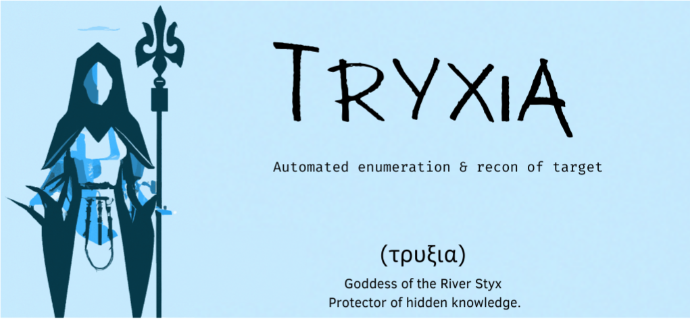

# Tryxia (τρυξια) 

  

</br>

**Tryxia** is a command line tool written in Python for use in bug bounty automation. It is designed to provide a comprehensive approach to bug bounty reconnaissance and enumeration.


<!-- <p align="center">
  
</p> -->


## 🚩 Features
- 📝 Automated enumeration & recon of target
- 🔍 Identifies open ports, subdomains, and more
- 🔐 MIT License
- 🐍 Written in Python

---

## 🔧 Installation

Tryxia requires Python 3.6 or higher.

```
$ git clone https://github.com/holmes-py/Tryxia
$ cd tryxia
$ pip install -r requirements.txt
```
---

## 🔨 Usage

Tryxia is designed to be used from the command line.

```
$ python tryxia.py -h
usage: tryxia.py [target.txt] [target Name]

Tryxia - Bug Bounty Reconnaissance Tool
```

## 📃 License

Tryxia is released under the MIT License. See [LICENSE](LICENSE) for more information.